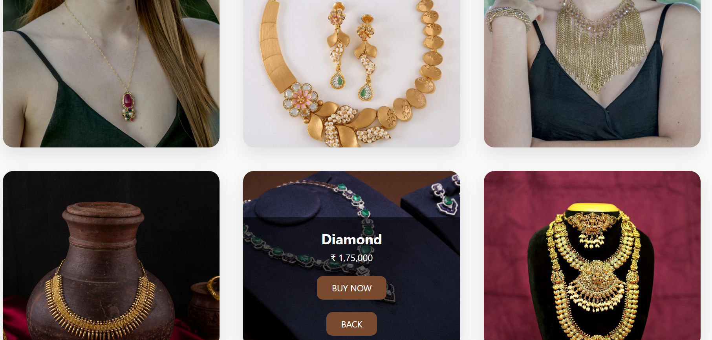
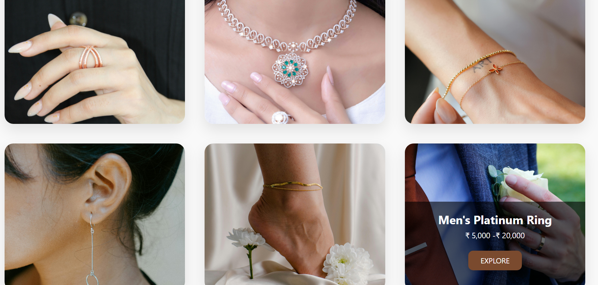
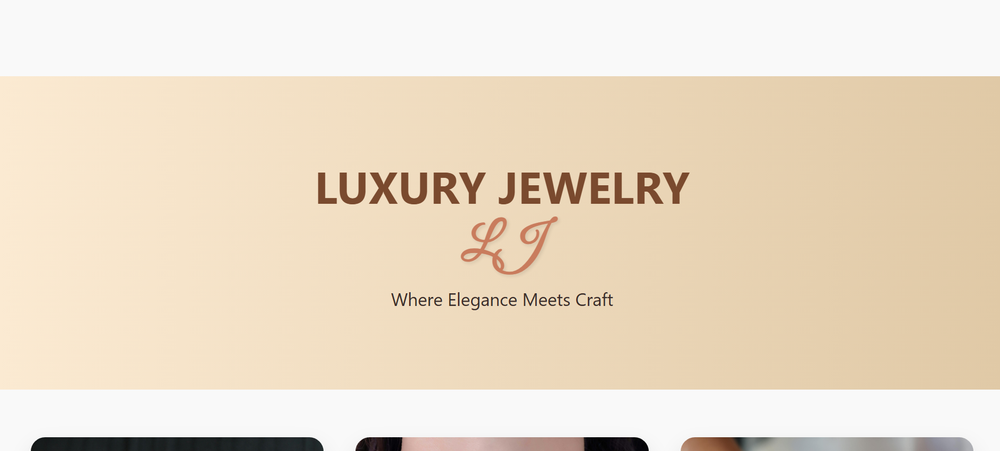

# 💎 Luxury Jewelry Website

A modern, responsive, and elegant jewelry website developed using **HTML** and **CSS**. This project showcases premium jewelry collections with an attractive user interface, responsive card layouts, and smooth hover effects to provide a visually appealing browsing experience.

---

## 📌 Overview

The Luxury Jewelry Website is a front-end web project designed to display different categories of jewelry in a clean and professional layout. The website emphasizes modern design principles, responsive styling, and user-friendly navigation.

This project is suitable for learning front-end web development concepts such as responsive layouts, CSS positioning, hover animations, and image cards.

---

## ✨ Features

- Responsive and modern user interface
- Elegant product card design
- Hover overlay effects
- Attractive typography
- Multiple jewelry categories
- Clean and organized code structure
- Mobile-friendly layout
- Smooth user experience

---

## 🛍️ Jewelry Categories

- 💍 Rings
- 📿 Necklaces
- 🪬 Bracelets
- 👂 Earrings
- 🦶 Anklets
- 💎 Premium Collections

---

## 🛠️ Technologies Used

- HTML5
- CSS3

---

## 📂 Project Structure

```
Luxury-Jewelry-Website/
│
├── index.html
├── style.css
├── images/
│   ├── ring.jpg
│   ├── necklace.jpg
│   ├── bracelet.jpg
│   ├── earrings.jpg
│   ├── anklet.jpg
│   └── ...
│
└── README.md
```

---

## 🚀 Getting Started

### Clone the Repository

```bash
git clone https://github.com/your-username/Luxury-Jewelry-Website.git
```

### Navigate to the Project

```bash
cd Luxury-Jewelry-Website
```

### Run the Website

Simply open the `index.html` file in your preferred web browser.

---

## Screenshots
<p align="center">
  <b> Images </b><br><br>
  
   
   
</p>
---

## 🎯 Learning Objectives

This project demonstrates:

- HTML page structure
- CSS Flexbox/Grid layouts
- Responsive web design
- Hover effects and transitions
- Image positioning
- UI card design
- Basic front-end development

---

## 🔮 Future Improvements

- Product details page
- Shopping cart
- Search functionality
- Category filters
- Dark mode
- Login & Registration
- Wishlist
- Backend integration
- Payment gateway
- Responsive navigation menu

---

## 🤝 Contributing

Contributions, suggestions, and improvements are welcome.

1. Fork the repository
2. Create a new feature branch
3. Commit your changes
4. Push the branch
5. Open a Pull Request

---

## 📄 License

This project is intended for educational and learning purposes.

---

## 👨‍💻 Author

**Chaithanya**

Electronics & Communication Engineering Student

Passionate about Web Development, VLSI, Embedded Systems, and Open Source.

GitHub: https://github.com/your-username

---

⭐ If you found this project helpful, consider giving it a **Star** on GitHub!
